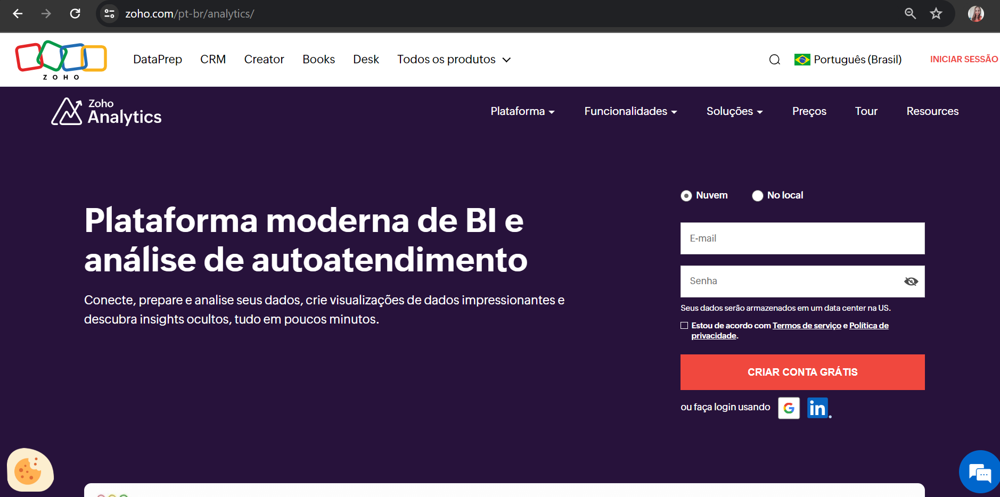
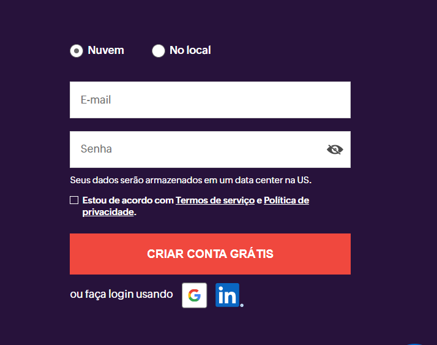

# Primeiros Passos com Zoho Analytics

## Introdução

 Este documento irá ajudá-lo a começar sua jornada de análise de dados com o Zoho Analytics. Siga os passos abaixo para criar sua conta gratuita e explorar a plataforma.

## Criando uma Conta Gratuita

Para começar a usar o Zoho Analytics, você precisa criar uma conta gratuita. Siga estas instruções:

1. Acesse o site oficial do Zoho Analytics clicando no link a seguir: [Zoho Analytics](https://www.zoho.com/pt-br/analytics/).
   
   

2. Clique no botão "Inscrever-se gratuitamente" na página inicial.
   
   

3. Preencha com e-mail e crie uma senha.

4. Após preencher todos os campos, clique no botão "Criar Conta".

5. Você receberá um e-mail de confirmação. Abra o e-mail e siga as instruções para confirmar sua conta.

6. Uma vez confirmada, você será redirecionado para a página inicial do Zoho Analytics, que deve se parecer com a imagem abaixo:

   

